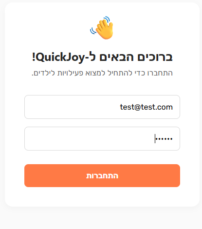
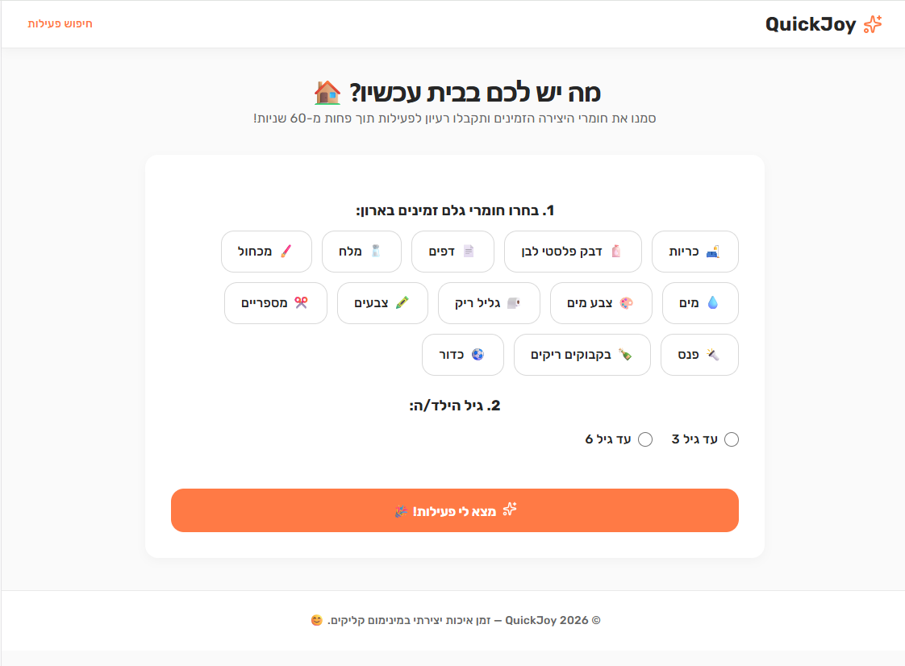
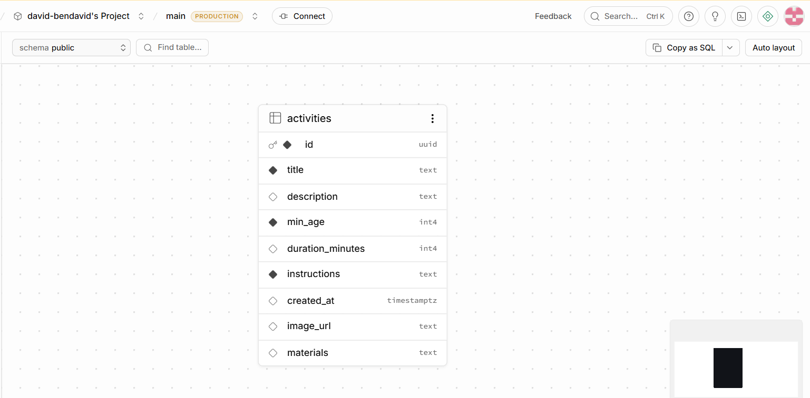

QuickJoy
QuickJoy היא אפליקציה המאפשרת להורים למצוא פעילויות יצירה לילדים בזמן אמת, על בסיס חומרים שכבר קיימים בבית.

🔗 קישור לפרויקט החי
[https://quickjoy-frontend.vercel.app/#home]

💡 סקירה כללית
QuickJoy היא פלטפורמה חכמה המסננת פעילויות יצירה לילדים בהתאם לציוד הזמין בבית. המערכת חוסכת להורים זמן יקר בחיפוש רעיונות ומונעת מצבים שבהם מתחילים פעילות ומגלים שחסר חומר בסיסי.

🎯 הבעיה שהפרויקט פותר
הורים רבים מתמודדים עם הקושי למצוא פעילות תעסוקה מיידית לילדים בבית. הניסיון למצוא רעיונות ברשת גוזל זמן, ולעיתים קרובות מוביל לתסכול כאשר מתברר שהציוד הנדרש לפעילות אינו זמין, מה שגורם לנטישת הפעילות עוד לפני שהחלה.

👥 קהל היעד
הורים לילדים בגילאי 3-6 שנמצאים בבית ומחפשים פתרון יצירתי, מהיר ונגיש להעסקת הילדים, ללא הכנות מוקדמות או קניות מיותרות.

⚖️ מתחרים ובידול
כיום, הורים משתמשים בכלים כמו Pinterest, חיפוש ידני בגוגל, או אפילו ניסיונות אלתור בראש. הבעיה בפתרונות אלו היא שהם לא "יודעים" מה יש לך בארון.
הבידול שלנו: בעוד שמתחרים מציעים פעילויות לפי "מה שטרנדי", QuickJoy פועלת הפוך – אנחנו מתחילים מהמצאי הקיים בבית. המשתמש מסמן את החומרים שברשותו, והאפליקציה מציגה אך ורק את מה שניתן לבצע כאן ועכשיו.

📸 צילום מסך

🛠️ הוראות הרצה
כדי להריץ את הפרויקט מקומית (לפיתוח):

בצע Clone לריפו: git clone [https://github.com/david-bendavid/quickjoy-frontend]

התקן ספריות: npm install

צור קובץ .env והגדר בו את המפתחות של Supabase:(יש לקבל אותם מכותב הפרויקט)

VITE_SUPABASE_URL=your_url

VITE_SUPABASE_ANON_KEY=your_key

הרץ: npm run dev

## 📊 מודל הנתונים (ERD)
הנה תרשים הישויות-קשרים של הפרויקט המציג את הטבלאות, העמודות והקשרים ביניהן:

🛠️ רשימת שירותים חיצוניים ואינטגרציות
הפרויקט נשען על השירותים הבאים כדי להבטיח ביצועים, אבטחה וחווית משתמש חלקה:
שם השירות	סוג	תפקיד במוצר
Supabase Auth	אוטנטיקציה	ניהול משתמשים (הרשמה והתחברות מאובטחת)
Supabase PostgreSQL	בסיס נתונים	אחסון מרכזי של כל נתוני האפליקציה, כולל רשימת הפעילויות, חומרים נדרשים והגדרות משתמש.
Vercel	פלטפורמת Deployment	אירוח האתר והגשתו למשתמשים בצורה מהירה
GitHub	ניהול גרסאות	אחסון קוד המקור וניהול גרסאות הפרויקט

